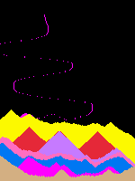

# Falling Sand
This is a rust project influenced by a youtube video thumbnail that I could not avoid

## Dependencies
- MacroQuad

## How to run
`cargo run`

## How to use
Sand will fall at the end of your mouse pointer while you hold down a key that corresponds to a sand color

| Key | Sand Color |
|-|-|
| P | Pink |
| F | Magenta |
| R | Red |
| M | Maroon |
| O | Orange |
| S | Beige |
| Y | Yellow |
| G | Green |
| C | Sky Blue |
| B | Blue |

## Screenshots
Pressing `;` at any point will take a screenshot and save it to `my_screenshot.png`

CAUTION: Taking another screenshot will overwrite the previous one unless it was renamed
